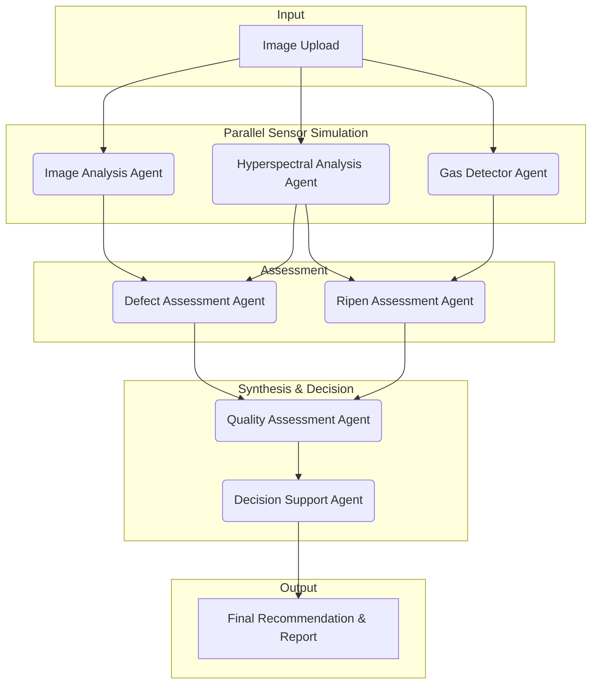

# EcoTribe: AI-Powered Fruit Quality Assessment 🍓🍏🍌

[](https://www.python.org/)
[](https://streamlit.io/)
[](https://www.langchain.com/)
[](https://python.langchain.com/docs/langgraph)
[](https://opensource.org/licenses/MIT)

**EcoTribe** is an innovative proof-of-concept developed for the "AI for less food wastage" challenge at the NTT DATA Business Solutions hackathon. It's an agentic AI framework that mimics human-like decision-making to assess fruit freshness from a single image, providing actionable insights for wholesalers and retailers to reduce food waste.

---

### 📺 **YouTube Demo**

Watch our project presentation and demo: **[https://www.youtube.com/watch?v=IqfzwnrvK24](https://www.youtube.com/watch?v=IqfzwnrvK24)**

---

## ✨ Key Features

-   **📸 Image-Based Analysis:** Simply upload a photo of a fruit to start the assessment.
-   **🤖 Agentic AI Workflow:** A multi-agent system collaborates to analyze different aspects of the fruit's quality.
-   **🔬 Simulated Advanced Sensing:** Mimics hyperspectral imaging and gas detection to infer internal quality and ripeness.
-   **📊 Comprehensive Quality Report:** Get a detailed breakdown of fruit characteristics, defects, ripeness, and overall quality grade.
-   **💡 Actionable Recommendations:** Provides suggestions on shelf life, potential discounts, and sales strategy.
-   **🧩 Explainable AI:** The step-by-step process provides transparency into how the final decision is reached.

---

## 🧠 The Agentic AI Framework

The core of EcoTribe is a sophisticated multi-agent workflow built with **LangGraph**. This approach breaks down the complex task of fruit quality assessment into smaller, manageable sub-tasks, each handled by a specialized AI agent. These agents work sequentially and in parallel, passing information through a shared state to build a comprehensive analysis.

### Workflow Diagram

The agents collaborate in a Directed Acyclic Graph (DAG) to process the data:



### The Agents

1.  **Image Analysis Agent:** Analyzes the visual properties of the fruit from the image, such as color, shape, and surface texture.
2.  **Hyperspectral Analysis Agent (Simulated):** Infers the internal condition of the fruit, detecting signs of spoilage that may not be visible to the naked eye.
3.  **Gas Detector Agent (Simulated):** Estimates the emission of gases like ethylene and CO2 to gauge the fruit's ripeness and metabolic activity.
4.  **Defect Assessment Agent:** Synthesizes information from the Image and Hyperspectral agents to identify specific defects like bruising, mold, or cracks.
5.  **Ripen Assessment Agent:** Combines gas and hyperspectral data to determine the exact stage of ripeness (e.g., fresh, partially-ripen, fully-ripen, spoiled).
6.  **Quality Assessment Agent:** Aggregates all prior analyses to classify the fruit into a standard quality grade (e.g., Extra Class, Class I, Class II, Below Standard).
7.  **Decision Support Agent:** A deterministic agent that translates the final quality grade into concrete business recommendations, including shelf life, discount percentage, and sales advice.

---

## 🛠️ Tech Stack

-   **Frontend:** **Streamlit** for the interactive web interface & **Plotly** for data visualization gauges.
-   **Backend:** **Python**
-   **AI Framework:** **LangChain** & **LangGraph** to orchestrate the agentic workflow.
-   **Language Model:** **Google Gemini** for its powerful multi-modal reasoning capabilities.
-   **Core Libraries:** `Pillow` for image handling.

---

## 🚀 How to Run Locally

1.  **Clone the repository:**
    ```bash
    git clone https://github.com/pimakshay/hacknow-ecotribe.git
    cd hacknow-ecotribe
    ```

2.  **Create a virtual environment and activate it:**
    ```bash
    python -m venv venv
    source venv/bin/activate  # On Windows use `venv\Scripts\activate`
    ```

3.  **Install the dependencies:**
    ```bash
    pip install -r requirements.txt
    ```

4.  **Set up your environment variables:**
    -   Create a file named `.env` in the root directory.
    -   Add your Google Gemini API key to it:
        ```
        GEMINI_API_KEY="YOUR_API_KEY_HERE"
        GEMINI_MODEL="gemini-1.5-flash"
        ```

5.  **Run the Streamlit app:**
    ```bash
    streamlit run frontend/app.py
    ```

    Open your browser and navigate to `http://localhost:8501`.

---

## 🤝 Contributing

This was a hackathon project, but contributions, issues, and feature requests are welcome! Feel free to check the issues page.

---

## 📜 License

This project is licensed under the MIT License.